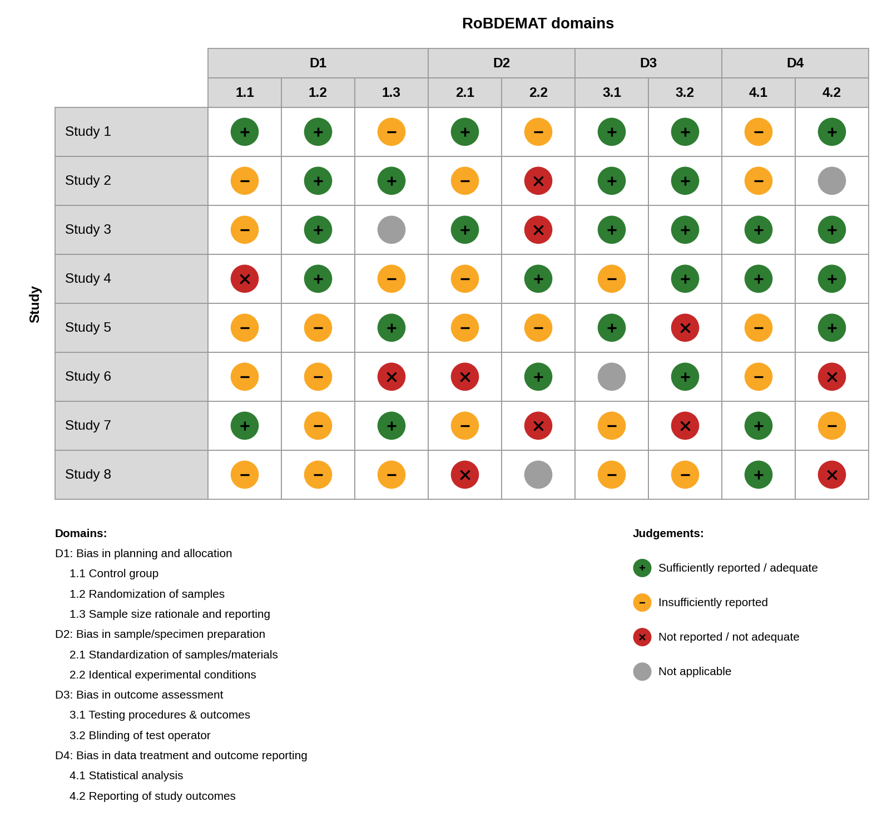

# RoBDEMAT Visualizer

A web tool for producing high-quality figures from **RoBDEMAT** (Risk of
Bias Tool for Pre-clinical Dental Materials Research) assessments. The link to the web tool can be found here: https://jonathanyuen.shinyapps.io/RoBDEMATvis/

You enter (or upload) the judgements you have already made for each study,
and the app draws publication-ready **traffic light** and **summary** plots
that you can customise and export as PNG or TIFF.



## How to use

1. **Download the Excel template** from the Home tab (or from the
   "Upload & edit data" tab).
2. **Enter your assessment data.** Replace the example studies with your own:
   - one study per row;
   - first column = study name;
   - one judgement per RoBDEMAT item (columns `1.1` to `4.2`);
   - keep the column headings and format unchanged.
3. **Upload the completed file** on the "Upload & edit data" tab (click
   **Start** on the Home tab to get there).
4. **Check or edit the data in the table** if needed (see below).
5. Open the **Traffic light plot** or **Summary plot** tab, adjust the
   appearance, and **download** the figure.

### Judgements

Use one of four codes in every cell:

| Code | Meaning |
|------|---------|
| `S`  | Sufficiently reported / adequate |
| `I`  | Insufficiently reported |
| `N`  | Not reported / not adequate |
| `NA` | Not applicable |

The full wording (for example "Sufficiently reported / adequate") is also
accepted. **Every cell must be filled in.** If any study name or judgement is
blank, the app shows an error listing what is missing and does not generate
the plots until it is completed.

### The nine RoBDEMAT items

| Domain | Items |
|--------|-------|
| D1: Bias in planning and allocation | 1.1 Control group; 1.2 Randomization of samples; 1.3 Sample size rationale and reporting |
| D2: Bias in sample/specimen preparation | 2.1 Standardization of samples/materials; 2.2 Identical experimental conditions |
| D3: Bias in outcome assessment | 3.1 Testing procedures & outcomes; 3.2 Blinding of test operator |
| D4: Bias in data treatment and outcome reporting | 4.1 Statistical analysis; 4.2 Reporting of study outcomes |

### Editing in the app

After uploading, your studies appear in an editable table:

- **Study names:** click a name to edit it.
- **Judgements:** click any assessment cell and choose from the four options.
- **Add a study:** click "Add study" to add a new row.
- **Edit or remove rows:** right-click a row to insert or remove it.

## The figures

**Traffic light plot** - one row per study, one column per item, grouped by
domain, with a footnote listing every domain and item and a legend for the
judgements.

**Summary plot** - a stacked bar for each item showing how many studies fall
into each judgement (study counts are printed on the bars).

### Customisation (both plots)

- Font and font size (8-16 pt)
- Colours for each judgement (colour picker or hex code), with a *Default*
  and a *Colour-blind friendly* palette
- Legend text for each judgement, and the option to hide a judgement from
  the legend if it is not used
- Traffic light plot only: circle size and the heights of the header and
  study rows

### Exporting

- **PNG or TIFF**, at the DPI you choose.
- The size is set **automatically** to fit the whole figure. Tick
  **Adjust manually** to set the width and height yourself.

## Running the app locally

1. Install [R](https://cran.r-project.org) (and, optionally,
   [RStudio](https://posit.co/download/rstudio-desktop/)).
2. Install the required packages once:

   ```r
   install.packages(c(
     "shiny", "ggplot2", "dplyr", "tidyr", "magrittr", "patchwork",
     "readxl", "openxlsx", "colourpicker", "rhandsontable"
   ))
   ```

3. Put `app.R` and the `www` folder (containing `example_figure.png`) in the
   same folder, then run:

   ```r
   shiny::runApp("path/to/that/folder")
   ```

## How to cite

If this tool was useful for your research, please consider citing it. Citation details are on the app's Home tab, which also offers `.ris` and `.nbib` downloads.

## Credits

- Developed by Jonathan Jun Xian, Yuen (DDS).
- Inspired by [robvis](https://github.com/mcguinlu/robvis) (McGuinness &
  Higgins), an R package and web app for visualising risk-of-bias
  assessments.
- The RoBDEMAT tool was developed by Delgado et al. (2022).

## Licence

This project is released under the [MIT Licence](LICENSE).
